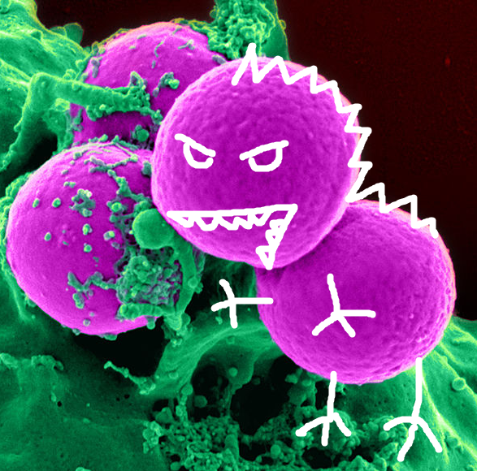
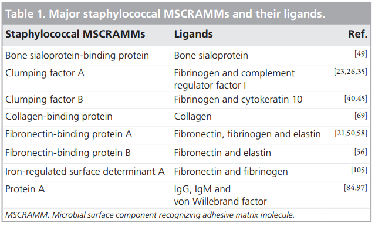
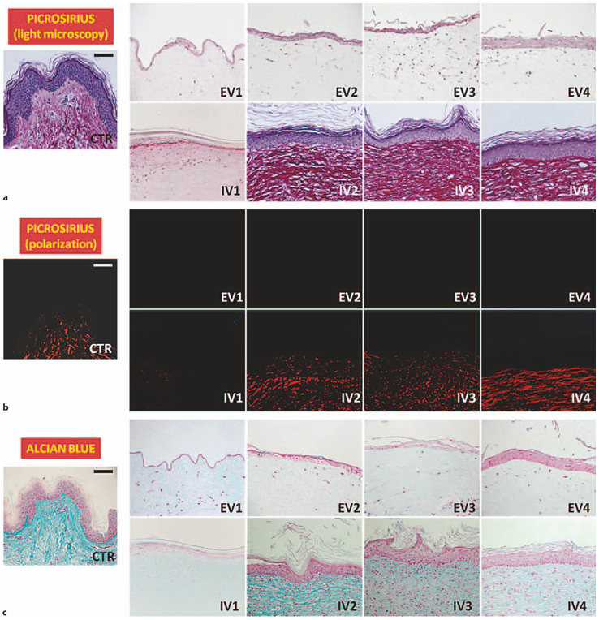
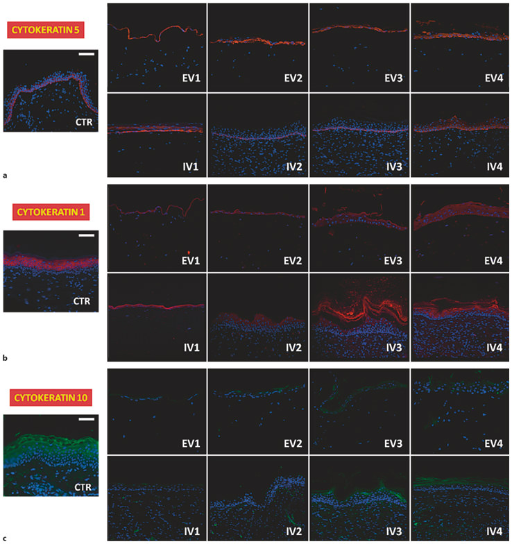
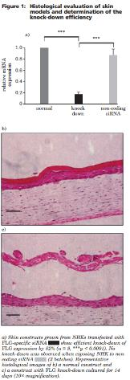
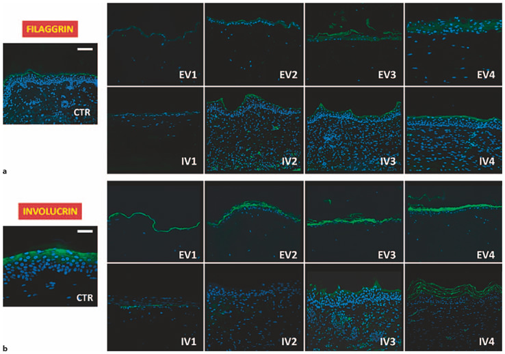

```{r,echo=F,message=F}
require(knitcitations)
require(knitr)
opts_chunk$set(echo=F,
               message=F)
options("citation_format"='pandoc')
#require(pandoc)
```

 
    
# Background
   
1. The reason for an increased colonization of atopic skin with *S. aureus* in unknown.
2. Microbial Surface components recognizing adhesive matrix molecules (MSCRAMMs) of S. aureus are recognizing FIBRONECTIN/FIBRINOGEN and bind to it.
3. The Fibronectin is incresed in the AD skin!!!! Healthy and diseased.
4. The reason for the increase in fibronectin in AD is unknown
5. Fibronectin might depend on the increased Th2 response in AD.
6. IL-4 can induce fibronectin production in skin.
7. Blocking of the FnbpA MSCRAMM of S. aureus can be a selective therapeutic target for the treatment of S. aureus.
8. Binding of S. aureus depends also on other factors!!!  so this needs further examination.

# Proposed mechanisms

## Skin scratching

The skin barrier is mechanically destroyed by scratching and extracellular matrix molecules (e.g. fibronectin, fibrinogen or collagen) which act as binding partners for the microbial surface components recognizing adhesive matrix molecules (MSCRAMMs) of _S.aureus_ are enriched at the lesional skin sites. As a result despite the antimicrobial activity mediated by the immune system, _S. aureus_ might be more prone to adhere to lesional skin sites of AD patients than other bacteria.

Possibly TSLP is making the Th2 respons more important and therefore the increasing FN production.

## The problem with IL-4 action on the FN production.

Two papers have totally different approach and understanding of IL-4 roles on 
producing the FN in skin. 

Pstlethwaite et al. `r citep("10.1172/JCI116015")` suggest that IL4 may be a "fi-
brogenic cytokine" that could be important in promoting biogenesis
of extracellular matrix proteins in normal wound healing
and in pathological fibrosis in which mast cells and T lymphocytes play a central role.

Authors found out that collagen in fibroblast culture as well as fibronectin production were upregulated in a dose dependent fashion under IL4 influence. It does not stimulate FIBROBLST growth. It increased the FN production fourfold. 


On the other hand `r citet("10.1016/j.jaci.2016.07.012")` state that IL-4 impairs wound healing potential in the skin by
repressing fibronectin expression.

The question is now who understood it better.

Both studies used cells from foreskin cell cultures, but the latter paper used actually ~100 cell lines. and the first paper analyzed GENE expression not PROTEIN expression as in the latter. 


## Importance of adhesion:

`r citet("http://emjreviews.com/therapeutic-area/dermatology/staphylococcus-aureus-and-atopic-dermatitis-which-came-first-the-chicken-or-the-egg/")` : 
One important mechanism promoting colonisation
is adherence of S. aureus to surface components
of the nasal epithelium or epidermal keratinocytes,
such as fibrinogen, fibronectin, and cytokeratins.
S. aureus utilises microbial surface components,
such as fibrinogen-binding proteins A and B, iron-
regulated surface determinant, and wall teichoic
acid, to bind adhesive matrix molecules. 24,25
Interestingly, pH values between 7 and 8, which
are usually found in AD after the disruption of
the skin barrier (compared with the pH values of
4.2–5.6 found in normal skin), are more likely to
support this adhesion process. 26 Furthermore, the
expression of fibronectin is regulated by IL-4, the
crucial Th2-promoting cytokine that is present in
higher concentrations in AD patients. 27


# Background information

## What are the MSCRAMMs on S. aureus 



## What ligands are present in epidermis/dermis ?


I could not find anything about bone sialoprotein in epidermis and dermis.

### Fibrinogen 
It is present in the dermis and epidermis

F3879-100MG 65.70


### Fibrin
It is present in the dermis and epidermis
F5386-1G 308.50

### Fibronectin
It is present in the dermis and epidermis


Sigma aldrich prod#: F2518-.5MG 574.00

### Elastin

Elastin from human skin
 E7402 insoluble powder (Sigma)
E7402-2MG	
324.50

### Collagen

C7624	Collagen human, Bornstein and Traub Type I, recombinant, expressed in Nicotiana tabacum (tobacco),	
C7624-5ML	
231.00

`r citet("10.1159/000330682")`




### Cytokeratin 10

How the  keratin look like in normal skin (the CTR ahe human skin sections)



HE staining revealed that FLG knock-down
resulted in obvious and strong alterations in the
morphology of the viable epidermis and stratum
corneum. In the normal skin model, all the epidermal
layers were clearly structured, and the typical
flattening of the keratinocytes that occurs during
epidermal differentiation could be seen (Figure
1b). By contrast, transfected (FLG knock-down)
skin constructs exhibited an obviously disturbed
development of the stratum corneum (Figure 1c),
with intercellular and intracellular spongiosis as a
permanent feature. The typical flattening of the
keratinocytes and the loss of nuclei during keratinocyte
differentiation were less pronounced in
the skin disease model. Furthermore, the staining
clearly revealed typically erected cells and their compact
organisation in the basal epidermal layer of the
normal tissue (Figure 1b). This was not observed in
the FLG knock-down model (Figure 1c).
The epidermal differentiation markers, involucrin,
keratin 10, keratin 14 and collagen IV, were
expressed in the skin constructs, both normal and
diseased, but with varying levels of intensity (data
not shown):




### Involucrin



Wholle human keratin...
K0253-1MG		242.50


## Diffecences in immuno histology of AD lesions 

### CKFL1
`r citet("10.7150/ijbs.6291")` show dfferent expression of this molecule in AD lesions.


### NGF and NPY


### Cathepsin L


### E selectin. 


### ICAM 1

### SSTR 1-5


### List:

1. Fibronectin
2. Fibrinogen
3. Fibrin
4. Elastin
5. Cytokeratin 10
6. Vitronectin
7. Involucrin
8. Collagen
9. ICAM-1
10. Beta-Neurexin
11. Cathepsin L 
12. E-selectin
13. Nerve growth factor
14. Neuropeptide Y
15. Chemokine-like factor


# Proposed experiments

## Staining of skin sections
 First we need to decide which CANDIDATE Proteins to include in our study

1. Establish the staining. 
2. Start with Sabine's samples,
3. Perform stainings on healthy skin
4. Primers for ligand genes. (UCSC)

1. We want to include proteins that are MSCRAMMS ligands and are present on hman skin. 
2. They must also be elevated in AD !! 

So first step is to conduct a literature search to describe such proteins. 

This search will be as follows:

1. Search for the proteins that are MSCRAMMS ligands for aureus. 
2. Search for proteins that are known to allow binding to aureus to skin
3. Search for differently expressed proteins in AD skin. 

### Genes that are upregulated in IL-4 treated HK cells:

RELN - Entrez Gene Summary for RELN Gene 
This gene encodes a large secreted extracellular matrix protein thought to control cell-cell interactions critical for cell positioning and neuronal migration during brain development. This protein may be involved in schizophrenia, autism, bipolar disorder, major depression and in migration defects associated with temporal lobe epilepsy. Mutations of this gene are associated with autosomal recessive lissencephaly with cerebellar hypoplasia. Two transcript variants encoding distinct isoforms have been identified for this gene. Other transcript variants have been described but their full length nature has not been determined. [provided by RefSeq, Jul 2008]

This would be a potential new candidate...

GPNMB: The protein encoded by this gene is a type I transmembrane glycoprotein which shows homology to the pMEL17 precursor, a melanocyte-specific protein. GPNMB shows expression in the lowly metastatic human melanoma cell lines and xenografts but does not show expression in the highly metastatic cell lines. GPNMB may be involved in growth delay and reduction of metastatic potential. Two transcript variants encoding different isoforms have been found for this gene. [provided by RefSeq, Jul 2008]

This is expressed on the keratinocytes according to the work of `r citet("10.1111/j.1600-0625.2008.00830.x")`

## What is the expression pattern of fibronectin during the course of AD (considering the acute and chronic phase)?

Using the skin biopsies from AD patients and healthy controls we will determine and compare the distribution patterns of fibronectin using immunohistochemistry (for the protein quantification) and qPCR (for the mRNA quantification).

### Ex. 1.1 Get the probes of AD skin from Sabine and their description  

Sabine has the probes from her thesis described. Dennis knows where they are. 
I will look for these tomorrow.

## 2. Which mechanisms (e.g. which cytokines) affect the expression of fibronectin in the skin?

Using either ex vivo skin or skin equivalents in cultures we will investigate which cytokines stimulate the expression of fibronectin using the above-mentioned methods.

## 3. Does increased fibronectin expression promote _S. aureus_ colonization?

Using fibronectin cell adhesion assay we will determine the adhesion of various bacteria to fibronectin. This will help to investigate which of skin commensals are predisposed to colonize skin during an increased fibronectin expression. This step will be repeated for other discovered MSCRAMMs ligands.

Afterward, using skin equivalents or ex vivo skin we will recreate the conditions resembling healthy human skin surface and subsequently introduce the cytokine milieu similar to AD (Th2 type of response). The observed changes in potential ligands for MSCRAMMs will lead to the subsequent phase - evaluation if _S. aureus_ introduced in these cultures will show an increased adherence to the treated skin.

## 4. Which other compounds may be plausible _S. aureus_ MSCRAMMs ligands in AD?
  
To identify further potential MSCRAMMs ligands we will perform in silico experiments based on the literature search. After identification of plausible candidates, we will perform binding assays to prove their interaction. We will repeat steps 1-3 to verify their clinical significance.

The results of these experiments will subsequently be used in further studies to evaluate the changes in the composition of the skin microbiome after challenge with topical application of MSCRAMMs ligands by performing our already established protocol for the quantification of selected bacterial species in skin samples (qPCR).


# Methods used in the studies

## Binding assays 

### Cover slip fibronecting binding. 

The GREEN eta l 1995 have used cover slips to bind aureus to fibronectin. There are two fibronectin binding 


# File manifest

1. Grantapp.Rmd is the file used for the actual grant applications. It was submitted to Prof. Maurer. 
2. README is this file
3. referencess.bib - is the bibliography. 


&Omega;

# References:

```{r}
write.bibtex(file="references.bib")
```
